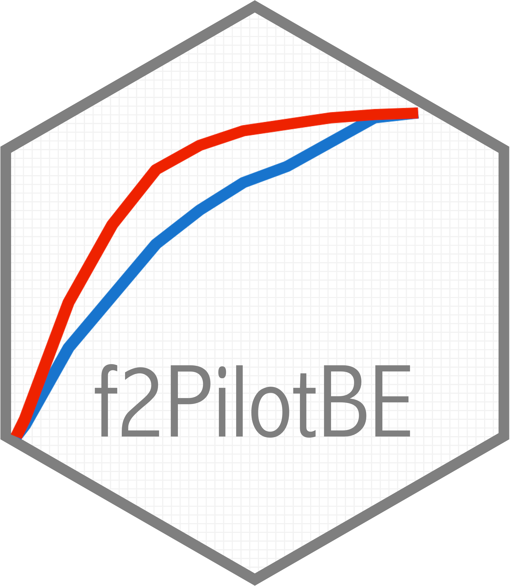

```{r, include = FALSE}
knitr::opts_chunk$set(
  collapse = TRUE,
  comment = "#>",
  fig.path = "man/figures/README-",
  out.width = "100%"
)
```


<!-- badges: start -->
<!--  -->
[](https://www.gnu.org/licenses/gpl-3.0.html)
[](https://github.com/LittlePetinga/f2PilotBE)
[](https://github.com/LittlePetinga/f2PilotBE)
[](https://github.com/LittlePetinga/f2PilotBE)
[](https://www.repostatus.org/#active)
[](https://doi.org/10.3390/pharmaceutics15051430)
[](https://doi.org/10.3390/pharmaceutics15102498)
[](https://github.com/LittlePetinga/f2PilotBE)
<!-- [](https://cran.r-project.org/package=f2PilotBE) 
[](https://github.com/LittlePetinga/f2PilotBE) -->
<!-- badges: end -->


<!-- Hex Sticker -->



The `f2PilotBE` package is designed to calculate the similarity factor *f*~2~ based on pharmacokinetic profiles from pilot bioavailability/bioequivalence (BA/BE) studies, as an alternative approach to assess the potential of bioequivalence of a Test product in comparison to a Reference product in terms of maximum observed concentration (C~max~) and area under the concentration-time curve (AUC).

This package is based on the publications of Henriques *et al.* (2023) [<a href="#references">1</a>,<a href="#references">2</a>], which propose the use of the geometric mean (G~mean~) *f*~2~ factor, for the comparison of the absorption rate (given by C~max~) of Test and Reference formulations. According to the articles, G~mean~ *f*~2~ factor using a cut-off of 35 showed a good relationship between avoiding type I and type II errors [<a href="#references">1</a>,<a href="#references">2</a>].

```{r, echo=FALSE, eval=TRUE}
library(ggplot2)
```


## Background

### The Similarity f2 Factor

The similarity *f*~2~ factor is a mathematical index widely used to compare dissolution profiles, evaluating their similarity, using the percentage of drug dissolved per unit of time. 

The similarity *f*~2~ factor, proposed by Moore and Flanner in 1996 [<a href="#references">3</a>], is derived from the mean squared difference, and can be calculated as a function of the reciprocal of mean squared-root transformation of the sum of square differences at all points:

$$f_{2}=50\cdot\log\biggl(100\cdot\biggl[1+\frac{1}{n}\sum_{t=1}^{t=n}{(\bar{R}_{t}-\bar{T}_{t})^2} \biggr]^{-0.5}\biggr)$$

where $f_{2}$ is the similarity factor, $n$ is the number of time points, and \(\bar{R}_{t}\) $\bar{R}_{t}$ and $\bar{T}_{t}$ are the mean percentage of drug dissolved at time $t$, for Reference and Test products respectively [<a href="#references">3</a>].

The *f*~2~ similarity factor ranges from 0 (when $\bar{R}_{t}-\bar{T}_{t}=100\%$, at all $t$) to 100 (when $\bar{R}_{t}-\bar{T}_{t}= 0\%$, at all $t$) [<a href="#references">3</a>].

<a href="#fig1">Figure 1</a> (from Henriques *et al.* (2023) [<a href="#references">1</a>]) presents the distribution of *f*~2~ similarity factor as a function of mean difference. Form the *f*~2~ equation, an average difference of <span style="color: red;">10%</span>, <span style="color: green;">15%</span>, and <span style="color: blue;">20%</span> from all measured time points results in a *f*~2~ value of <span style="color: red;">50</span> (red dotted lines), <span style="color: green;">41</span> (green dotted lines) and <span style="color: blue;">35</span> (blue dotted lines), respectively.

<!-- Figure from article (Part 1) -->
<figure>
  
  <figcaption>Figure 1. <a name="fig1"></a> Distribution of ƒ~2~ similarity factor as a function of mean difference. ƒ~2~ similarity factor is derived from the mean squared difference and can be calculated as a function of the reciprocal of the mean squared-root transformation of the sum of square differences at all points. An average difference of <span style="color: red;">10%</span>, <span style="color: green;">15%</span>, and <span style="color: blue;">20%</span> from all measured time points results in a ƒ~2~ value of <span style="color: red;">50</span> (red dotted lines), <span style="color: green;">41</span> (green dotted lines) and <span style="color: blue;">35</span> (blue dotted lines), respectively.</figcaption>
</figure>

<!-- Code for plot of distribution of ƒ~2~ similarity factor as a function of mean difference -->
<!-- Not run -->
```{r, echo=FALSE, eval=FALSE}
f2.factor <- data.frame(
  Difference = seq(0,100,by=.05)
)
f2.factor$MSE <- f2.factor$Difference^2
f2.factor$f2  <- 50*log10(100*((f2.factor$MSE+1)^-0.5))

f2_intercept <- f2.factor[f2.factor$Difference %in%c (10,15,20),c(1,3)]

print(ggplot(f2.factor,
             aes(x = Difference,
                 y = f2))
      + geom_line()
      + labs(x = 'Mean Difference (%)', 
             y = bquote(italic(f)[2]~'Factor'))
      + geom_segment(aes(x=f2_intercept[1,1],xend=f2_intercept[1,1],y=-Inf,yend=f2_intercept[1,2]),
                     linetype=2,size=.2,colour='red')
      + geom_segment(aes(x=-Inf,xend=f2_intercept[1,1],y=f2_intercept[1,2],yend=f2_intercept[1,2]),
                     linetype=2,size=.2,colour='red')
      + geom_segment(aes(x=f2_intercept[2,1],xend=f2_intercept[2,1],y=-Inf,yend=f2_intercept[2,2]),
                     linetype=2,size=.2,colour='darkgreen')
      + geom_segment(aes(x=-Inf,xend=f2_intercept[2,1],y=f2_intercept[2,2],yend=f2_intercept[2,2]),
                     linetype=2,size=.2,colour='darkgreen')
      + geom_segment(aes(x=f2_intercept[3,1],xend=f2_intercept[3,1],y=-Inf,yend=f2_intercept[3,2]),
                     linetype=2,size=.2,colour='darkblue')
      + geom_segment(aes(x=-Inf,xend=f2_intercept[3,1],y=f2_intercept[3,2],yend=f2_intercept[3,2]),
                     linetype=2,size=.2,colour='darkblue')
      + scale_y_continuous(limits = c(0,100),breaks=seq(from = 0, to = 100, by = 10))
      + scale_x_continuous(limits = c(0,100),breaks=seq(from = 0, to = 100, by = 10))
      + theme_bw()
      + theme(panel.background = element_blank(),
              panel.grid.major = element_blank(),
              panel.grid.minor = element_blank(),
              legend.position = "bottom"))
```

As proposed by Henriques *et al.* (2023), the concept of similarity factor *f*~2~ can be applied as an alternative to the average bioequivalence analysis, for pilot BA/BE studies [<a href="#references">1</a>,<a href="#references">2</a>].


### Cmax Similarity f2 Factor

*f*~2~ can be used to assess the similarity on the rate of drug absorption by normalizing Test and Reference mean concentration-time profiles to the maximum plasma concentration (C~max~) derived from the mean Reference profile, until Reference C~max~ is observed (Reference t~max~) [<a href="#references">1</a>,<a href="#references">2</a>]:

$$C_{t}^{N}=100\cdot\frac{\bar{C}_{t}}{C_{max,R}}$$, where $0 \le t \le t_{max,R}$,

where $C_{t}^{N}$ is the normalized concentration at time $t$, $\bar{C}_{t}$ is the mean (Test or Reference) concentration at time $t$, $C_{max,R}$ is the C~max~ of the Reference mean concentration-time profile, and $t_{max,R}$ the time of observation of $C_{max,R}$. The similarity *f*~2~ factor is calculated as

$$C_{max}f_{2}=50\cdot\ log \biggl(100\cdot \biggl[1+\frac{1}{n} \sum_{t=1}^{t=n}{(R_{t}^{N} - T_{t}^{N})^2} \biggr]^{-0.5} \biggr)$$

where $n$ is the number of time points until Reference $t_{max}$, and $R_{t}^{N}$ and $T_{t}^{N}$ are the normalized concentration at time $t$, for Reference and Test products respectively.


### Bioequivalence Evaluation of Pilot Studies

For the planning of pilot BA/BE studies, a decision tree is proposed (<a href="#fig2">Figure 2</a>, from Henriques *et al.* (2023) [<a href="#references">2</a>]).

For drug products with a known Intra-Subject Coefficient of Variation (ISCV%) below 20%, the authors propose the estimation of the sample size for a pilot study assuming a Test-to-Reference Geometric Least Square Mean Ratio (GMR) of 100%, a power of 80%, and an α of 0.05 [<a href="#references">1</a>, <a href="#references">2</a>].
However, for cases of higher ISCV% or unknown variability, it is propose the use of a fixed sample size of **20 subjects**, as the use of higher sample sizes has not shown to increase the study power meaningfully, but was sufficient to avoid substantial type I errors [<a href="#references">2</a>].

Regarding the analysis of data from pilot studies, the authors propose to initially analyze the data using the average bioequivalence approach. For the case in which the calculated GMR and the corresponding 90% CI are not within [80.00–125.00]%, the alternative G~mean~ *f*~2~ factor method should be used with a cut off of 35, as it was shown to be a valuable indicator of the potentiality of the Test formulation to be bioequivalent in terms of C~max~:

1. If the *f*~2~ factor is above or equal to **35** (corresponding to a difference of 20% between Test and Reference concentration–time profiles until the Reference t~max~), the confidence to proceed to a pivotal study is higher than 90% when ISCV% is lower or equal to 20%; the confidence is higher than 80% when ISCV% is within 20% and 30%; and the confidence is higher than 60% when ISCV% is higher than 40% [<a href="#references">2</a>].

2. If the *f*~2~ factor is above or equal to **41** (corresponding to a difference of 15% between Test and Reference concentration–time profiles until the Reference t~max~), the confidence to proceed to a pivotal study is higher than 90% for ISCV% until 40%, and higher than 80% for ISCV% within 50% to 60% [<a href="#references">2</a>].

3. If the *f*~2~ factor is above or equal to **50** (corresponding to a difference of 10% between Test and Reference concentration–time profiles until the Reference t~max~), the probability of the Test product to be truly bioequivalent to the Reference product in terms of C~max~, i.e., the confidence to proceed to a pivotal study, is higher than 90%, irrespective of the ISCV% [<a href="#references">2</a>].

<figure>
  
  <figcaption>Figure 2. <a name="fig2"></a> Proposed decision tree for planning and analysis of pilot BA/BE studies.</figcaption>
</figure>


## The f2PilotBE Package

The `f2PilotBE` is equipped with the following functions to aid in the calculation of the similarity *f*~2~ factor:

* `AUC()`

* `AUClast()`

* `Cmax()`

* `f2.AUC()`

* `f2.Cmax()`

* `f2()`

* `geomean()`

* `Tmax()`


### Installation

#### From GitHub

To install the development version of `f2PilotBE`, start by installing the `devtools` package from CRAN:

```{r, echo=TRUE, eval=FALSE}
install.packages("devtools")
```

Then the development version of `f2PilotBE` can be installed from GitHub as:

```{r, echo=TRUE, eval=FALSE}
library(devtools)
install_github("LittlePetinga/f2PilotBE")
```


### Examples

#### Load Package

Following installation, load the `f2PilotBE` package and the `ggplot2` package.

```{r, echo=TRUE, eval=FALSE}
# Load packages
library("ggplot2")      # required for plotting
library("f2PilotBE")
```


#### Calculate Geometric Mean Concentration

As proposed by the authors [<a href="#references">1</a>,<a href="#references">2</a>], the *f*~2~ similarity factor should be calculated from the arithmetic (A~mean~) or geometric (G~mean~) concentration-time profiles.

The `f2PilotBE` provides a function (`geomean()`) for the calculation of the G~mean~. For the calculation of the G~mean~ profile for Test and Reference products, first, import the individual concentration-time data, and calculate the G~mean~ concentration-time profiles for each Treatment, as follows.

```{r, echo=TRUE, eval=FALSE}
# Import individual concentration data
dta_id <- read.csv('dta_id.csv')


# Calculate the geometric mean for each Treatment, by time point
dta <- data.frame(t(tapply(dta_id$Concentration, 
                           dta_id[,c('Treatment','Time')], 
                           geomean)))
dta$Time <- as.numeric(row.names(dta))
row.names(dta) <- c()

```

The code above, will apply (`tapply`) the `geomean` function for each given treatment, and each timepoint.

If the user prefers to use the A~mean~, instead of the G~mean~ concentration-time data, simply replace the function `geomean`, with the function `mean` from base `R`.


#### Calculate Cmax Similarity f2 Factor

The `f2.Cmax()` function allows to calculate the *f*~2~ similarity factor for C~max~, from Test and Reference mean concentration-time profiles.

This function allows some flexibility on the structure of the mean concentration-time dataframe. Treatment (Test and Reference) information should either be provided in columns (pivoted) or rows (stacked). For both cases a column with `Time` information should always be provided:

1. For the case where Treatment information is provided in **columns** (pivoted), as in the following example:

```{r, echo=TRUE, eval=TRUE}
# Create mean concentration-time data for Test and Reference product
# where treatment information is pivoted
dta_piv <- data.frame(
  Time = c(0, 0.25, 0.5, 0.75, 1, 1.5, 1.75, 2, 2.25, 2.5,
           2.75, 3, 3.25, 3.5, 3.75, 4, 6, 8, 12, 24),
  Ref = c(0.00, 221.23, 377.19, 494.73, 555.74,
          623.86, 615.45, 663.38, 660.29, 621.71,
          650.33, 622.28, 626.72, 574.94, 610.51,
          554.02, 409.14, 299.76, 162.85, 27.01),
  Test = c(0.00, 149.24, 253.05, 354.49, 412.49,
           530.07, 539.68, 566.30, 573.54, 598.33,
           612.63, 567.48, 561.10, 564.47, 541.50,
           536.92, 440.32, 338.78, 185.03, 31.13)
 )
```

The *f*~2~ similarity factor for C~max~ can be calculated from the mean concentration-time profiles, applying the `f2.Cmax()` function as follows:

```{r, echo=TRUE, eval=TRUE}
# Calculate f2 Factor for Cmax when treatment data is pivoted:
f2.Cmax(dta_piv, Time = "Time", Ref = "Ref", Test = "Test", plot = FALSE)
```

As demonstrated above, for the case when treatment data is pivoted, the `f2.Cmax()` function requires the indication of: (1) the dataframe with mean concentration-time data (in this case `dta = dta_piv`), (2) the name of the column in the dataframe with time information (in this case `Time = "Time"`), (3) the name of the column in the dataframe with concentration information for the Reference product (in this case `Ref = "Reference"`), and (4) the name of the column in the dataframe with concentration information for the Test product (in this case `Test = "Test"`).

Please note that `Trt.cols` is not required, as it defaults to `TRUE` (i.e, logical value indicating whether treatment is presented in columns/pivoted).


2. For the case where Treatment information is provided in **rows** (stacked), as in the following example:

```{r, echo=TRUE, eval=TRUE}
# Create mean concentration-time data for Test and Reference product
# where treatment information is stacked
dta_stk <- data.frame(
  Time = rep(c(0, 0.25, 0.5, 0.75, 1, 1.5, 1.75, 2, 2.25, 2.5,
               2.75, 3, 3.25, 3.5, 3.75, 4, 6, 8, 12, 24),2), 
  Trt = c(rep('R',20), rep('T',20)),
  Conc = c(c(0.00, 221.23, 377.19, 494.73, 555.74,
             623.86, 615.45, 663.38, 660.29, 621.71,
             650.33, 622.28, 626.72, 574.94, 610.51,
             554.02, 409.14, 299.76, 162.85, 27.01),
           c(0.00, 149.24, 253.05, 354.49, 412.49,
             530.07, 539.68, 566.30, 573.54, 598.33,
             612.63, 567.48, 561.10, 564.47, 541.50,
             536.92, 440.32, 338.78, 185.03, 31.13))
)
```


The *f*~2~ similarity factor for C~max~ can be calculated from the mean concentration-time profiles, applying the `f2.Cmax()` function as follows:

```{r, echo=TRUE, eval=TRUE}
# Calculate f2 Factor for Cmax when treatment data is stacked:
f2.Cmax(dta_stk, Time = "Time", Conc = "Conc",
        Trt = "Trt", Ref = "R", Test = "T",
        Trt.cols = FALSE, plot = FALSE)
```

As demonstrated above, for the case when treatment data is stacked, the `f2.Cmax()` function requires the indication of: (1) the dataframe with mean concentration-time data (in this case `dta = dta_stk`), (2) the name of the column in the dataframe with time information (in this case `Time = "Time"`), (3) the name of the column in the dataframe with concentration information (in this case `Conc = "Conc"`), (4) the name of the column in the dataframe with treatment information (in this case `Trt = "Trt"`), (5) the nomenclature in the dataframe for the Reference product (in this case `Ref = "R"`), (6) the nomenclature in the dataframe for the Test product (in this case `Test = "T"`), and (7) indication that treatment is presented in rows/stacked (`Trt.cols = FALSE`).


For both cases, a graphical representation of the normalized Test and Reference concentrations over time, by Reference C~max~, until Reference t~max~, can be generated, by simply turning `plot` to `TRUE`:

```{r, echo=TRUE, eval=TRUE, out.width="70%"}
# Calculate f2 Factor for Cmax, and plot normalized concentration by Reference Cmax
f2.Cmax(dta_piv, Time = "Time", Ref = "Ref", Test = "Test", plot = TRUE)
```


By default, `f2.Cmax()` plots the Reference product in `black`, and the Test product in <span style="color: blue;">`blue`</span>, nevertheless, the user can personalize the output plot with different colours according to their preference, by using `col.R` and `col.T`, for Reference and Test product respectively:


```{r, echo=TRUE, eval=TRUE, out.width="70%"}
# Calculate f2 Factor for Cmax, and plot normalized concentration by Reference Cmax
f2.Cmax(dta_piv, Time = "Time", Ref = "Ref", Test = "Test", 
        plot = TRUE, col.R = "darkblue", col.T = "red")
```


## References
<a name="references"></a>

1. Henriques, S.C.; Albuquerque, J.; Paixão, P.; Almeida, L.; Silva, N.E. (2023). Alternative Analysis  Approaches for the Assessment of Pilot Bioavailability/Bioequivalence Studies. *Pharmaceutics*. *15*(5), 1430. [10.3390/pharmaceutics15051430](https://doi.org/10.3390/pharmaceutics15051430).

2. Henriques, S.C.; Paixão, P.; Almeida, L.; Silva, N.E. (2023). Predictive Potential of C~max~ Bioequivalence in Pilot Bioavailability/Bioequivalence Studies, through the Alternative *f*~2~ Similarity Factor Method. *Pharmaceutics*. *15*(10), 2498. [10.3390/pharmaceutics15102498](https://doi.org/10.3390/pharmaceutics15102498).

3. Moore, J.W.; Flanner, H.H. (1996). Mathematical Comparison of Curves with an Emphasis on in Vitro Dissolution Profiles. *Pharm. Technol.*. *20*, 64--74.
